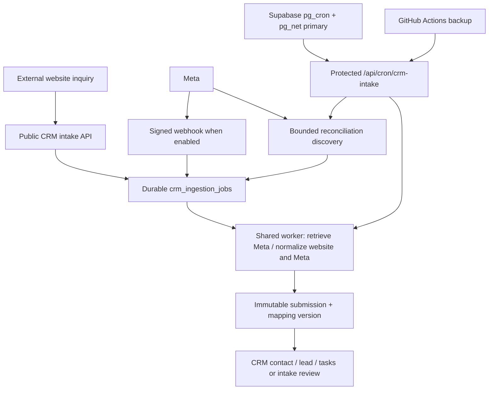
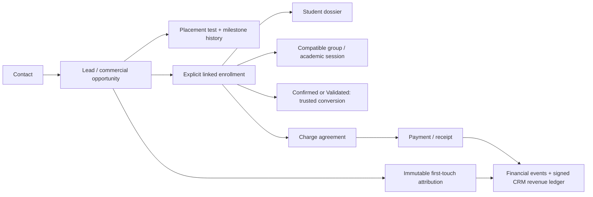

# Current architecture

## CI + Codex Workflow Efficiency v2 — tooling-only fast path proposed, 2026-10-04

PR #90 proposes a conservative third pull-request CI mode in [Verify](../../.github/workflows/verify.yml): `docs`, `tooling`, and `full`. The dependency-free [CI verifier](../../scripts/ci/verify.py) keeps uncertainty fail-closed to `full`.

The `tooling` lane is limited to regular files under `tools/**`, the explicitly allowlisted Meta debugger monitor regression test, and accompanying safe `docs/**/*.md`. It runs docs verification plus the normal app/unit/build/security job and skips only the expensive `local-database` job. Runtime/database/configuration/CI-policy/package/unknown paths remain `full`. Rename detection stays disabled so both old/new paths are evaluated.

This is a **Tier 2 engineering-policy/CI-routing change** because it changes required test selection and can affect merge verification, but it does not modify runtime behavior, Production configuration, provider credentials, database state or release/activation authority. Tier 2 therefore requires exact-head CI plus fresh independent review. The PR itself modifies `.github/**` and `scripts/ci/**`, which are excluded from the tooling allowlist, so it must pass full CI once before merge.

The always-running `required` aggregate remains the branch-protection check: `docs` requires docs success with app/database skipped; `tooling` requires docs + app success with database skipped; `full` requires app + local-database success for pull requests. See [policy](../../AGENTS.md#ci-selection-and-remote-ci-handoff) and the [tooling fast-path plan](../architecture/plans/ci-tooling-fast-path.md).

The earlier v1 docs-vs-full description is superseded if PR #90 is adopted.

## H3 Revision 7 owner approval and Step 2 preparation — 2026-10-03

Revision 7 at PR #64 is owner-approved as recorded in the [Step 2 approval and preparation contract](../architecture/plans/crm-h3-05-revision-7-step-2-preparation.md#approval-and-evidence-boundary). Earlier proposal status below is historical. C2/B1/B4/B5 design is unchanged; no runtime, SQL or deployed architecture changed. External custody selection and a reviewed secret-safe inspector remain execution prerequisites; architecture approval grants no operation authority.

## Proposed H3 credential validation amendment — Revision 7

[Revision 7](../architecture/plans/crm-h3-05-revision-7-validation.md) proposes C2: one new lifecycle-only owned app/Employee, inspected effective authority and mandatory exclusive identity-wide revocation rehearsal before credential acceptance. Official mechanisms, read-only account facts and separately authorized empirical recovery evidence can suffice without Meta support. This is not approved or implemented; no deployed architecture changes. [Evidence](../architecture/evidence/crm-h3-revision-7-validation-2026-10-03.md) preserves PR #63 and distinguishes non-event credential acceptance from actual delivery proof. Existing R4/106, dormant gates and H4 separation remain unchanged; dated direct-route/revision-6 statements below do not authorize issuance.

## H3-04 immutable contract seed — Production verified 2026-10-02

[PR #57](https://github.com/elforssa/english-hills-admin/pull/57) merged/deployed as `e3928b369c8790151771d7251aee7030289ec84f`; forward migration 106 is verified in Production ledger 001–106. The existing append-only registry contains exactly one approved R4 provider manifest. [Release acceptance](../architecture/evidence/crm-h3-04-production-2026-10-02.md) verifies unchanged schema/functions/owners/ACL/RLS/triggers and dormant independent gates. Manifest active=true cannot initiate delivery: no destination, policy/evidence/boundary/ownership/epoch, token, live gate or active lifecycle cron exists. H3-05–08/H4 remain separately gated. Earlier branch observations below retain their historical limits.

H3-05 Entitlement and dedicated secret is the next gated step; it has not been executed or authorized by this closeout. It requires its own artifact-bound operator approval and fresh preflight under revision 5.

## H3-04 immutable contract seed — branch implementation 2026-10-02

Forward migration 106 inserts one owner-approved R4 contract into the existing append-only provider registry; schema, ACL/RLS, trigger/security attributes, functions and independent send gates are unchanged. [Manifest and acceptance evidence](../architecture/evidence/crm-h3-04-implementation-2026-10-02.md). No destination/source/policy/boundary/ownership/epoch or live gate is created. Branch implementation is not deployment; [current state](CURRENT_STATE.md) records inherited H3-03 verification through 105.

> **Production verified — 2026-10-01:** PR #47 reviewed head `f823b62a3bb06d40b1f572927bfa2af60fd4c857` merged and deployed as `02ffccab1519c0b381196ef9e5f938a908fdd105`; ledger 001–103 and advisory R4 controls are verified dormant. Lifecycle inventory is zero, cron disabled and server live gate absent; existing intake is healthy. [Dated release evidence and limitations](../architecture/evidence/crm-r4-advisory-production-2026-10-01.md). Earlier not-merged/not-deployed or two-event baseline statements below are historical and superseded for current deployment state. Provider seed, Meta/credential changes, Production release and H4 remain unauthorized; the separately commissioned H3-02 branch is recorded below.

> Finally owner-approved 2026-10-01 (PR #46, architecture head `c404815`): [R4 advisory D2 amendment](../architecture/plans/completed/crm-meta-funnel-r4-d2-advisory.md) changes custom proof from mandatory to recommended while preserving platform/legal/privacy, source/identity, prospective cutoff, producer ownership, five-event and no-uncertain-replay safeguards. Any mandatory-D2 text below describes the deployed baseline until reviewed forward implementation; actual withdrawals/stops remain enforceable even without a grant. The approved opportunity/contact/pending stop scopes and exact lock/retention contract are part of this architecture. Migration 103 and compatible runtime/UI are implemented on `codex/r4-advisory-d2`, pending exact-head CI and independent review; see the [implementation record](../architecture/evidence/crm-r4-advisory-implementation-2026-10-01.md). This branch is not merged or deployed; deployment is NOT authorized; H3/H4 are NOT approved and remain blocked. [Final approval record](../architecture/plans/completed/crm-meta-funnel-r4-d2-advisory.md#final-owner-architecture-approval-2026-10-01).

Read [CURRENT_STATE](CURRENT_STATE.md) for the main baseline versus documented deployment. Decisions and rationale are indexed in [ADRs](../architecture/decisions/README.md).

## H3-02 branch compatibility correction — 2026-10-02

[Approved H3 revision 5](../architecture/plans/crm-h3-technical-readiness.md) is implemented on `codex/crm-h3-02-compatibility` by the live adapter and forward migration 104: transient multipart token authentication and strict original-source/activity exported seconds. Existing pure-hold callers revalidate get, prepare, committed begin, claim and retry with unchanged ACLs and sharing-stop lock hierarchy. Prepared payloads also revalidate in the adapter. [Evidence](../architecture/evidence/crm-h3-02-implementation-2026-10-02.md). This branch is not merged/deployed; Production remains verified dormant through 103. No activation data or credentials are introduced.

## Application and database

Next.js 15 App Router serves the admin workspace, role portals, public enrollment and API handlers. [Admin layout](../../src/app/(admin)/layout.jsx) wraps pages in ProtectedRoute; [middleware](../../src/middleware.js) refreshes sessions and gates page routes. Handlers authenticate independently. Stored `profiles.role` joins Auth through `profiles.id = auth.users.id`; authorization continues into RPCs/RLS.

[entities.js](../../src/lib/entities.js) provides ordinary entity CRUD and [queries.js](../../src/lib/queries.js) TanStack Query caching. CRM uses [dedicated RPC hooks](../../src/lib/crm/queries.js) and guarded SQL commands/read models. Browser/session server clients live in [supabase.js](../../src/lib/supabase.js); privileged [supabase-admin.js](../../src/lib/supabase-admin.js) is server-only. PostgreSQL transactions, constraints, triggers and cumulative migrations own cross-entity integrity. Storage uses an asset registry and authorized signing/finalization endpoints (045–046), not public dossier URLs.

## Acquisition and scheduling

The primary trigger exists in migration 095; Production activation was independently verified in owner-supplied evidence on 2026-09-29 (see CURRENT_STATE). Both triggers invoke the same bounded endpoint, use the dedicated scheduler bearer, and rely on database leases plus unique event identities. Reconciliation discovers IDs only; the shared worker retrieves and normalizes them. Independent webhook/reconciliation switches allow polling while webhook access is unavailable. [ADR-002](../architecture/decisions/ADR-002-meta-intake-and-reconciliation.md) and [scheduler runbook](../crm-intake-scheduler.md) contain limits and activation details.

Website acceptance means durable receipt, not immediate lead resolution. Exact-origin checks, validation, rate limiting and optional CAPTCHA precede queueing. Immutable mapping versions normalize core fields and flexible answers; uncertain matching becomes review. [Website contract](../crm-website-inquiries.md).

The source model supports multiple Meta form IDs per Page connection and multiple website form keys per configured origin; immutable mapping versions are independent of campaign/ad attribution. Director configuration RPCs exist, but no inbound connection/mapping onboarding UI was found. Current lifecycle source boundaries are per mapping, while destination/epoch controls are shared; uninterrupted addition of another live source needs separate platform assessment. See the [source-backed multi-source assessment](../architecture/evidence/crm-multi-source-readiness-2026-10-01.md). Website immediate CAPI Lead and website lifecycle matching are owner-directed later adapter work, not current runtime capability or an H3 prerequisite.

## CRM and school operations

Placement booking/results drive tasks and activities, not automatic enrollment/payment. Enrollment commands review existing learner candidates; enrollment/student/group triggers preserve membership consistency (070–074, 083–084). Groups, levels, timetables, attendance and Premium sessions share academic relationships; [071](../../supabase/migrations/071_teacher_academic_relationships.sql) governs teacher academic access.

Payments use the existing charge/receipt engine and explicit CRM enrollment identity. Revenue attribution follows linked receipts and immutable first touch (085); director analytics combines operational cohorts and available spend snapshots (089–090). Insights remains fixture-only. Deployed migrations 098–100 extend lifecycle feedback with explicit eligibility evidence, prospective activation epochs, lead-ID-only live payload enforcement, retention cleanup, director-only diagnostics and an independent `crm-lifecycle-primary` scheduler. Production verification on 2026-09-30 found that scheduler inactive, with zero provider contracts, policies/evidence, open activation epochs, live deliveries or enabled lifecycle destinations. No provider credentials/configuration or form changes were made. The live path therefore remains dormant and fail closed pending H3/H4; deployment is not evidence of live Meta activation.

Teacher operational identity is projected through [teacher-directory.js](../../src/lib/teacher-directory.js). Full teacher rows contain HR/compensation and are isolated from non-HR consumers (043); payroll writes use an authenticated admin/director API and database guard (065). Batch 1 added the fixed receptionist operational teacher projection in 096, with Production activation reported by the owner. PR #32 and 097 completed the shared Students UI and enrollment-aware group filter; Batch 1 Production verification was owner-confirmed on 2026-09-29. [Security rules](SECURITY_RULES.md).

## Reconciliation ownership conflicts — Production verified, 2026-10-02

Forward [migration 105](../../supabase/migrations/105_crm_meta_reconciliation_business_conflicts.sql) and the narrow server/worker path implement the accepted [ADR-002 amendment](../architecture/decisions/ADR-002-meta-intake-and-reconciliation.md#accepted-amendment--bounded-ownership-conflicts-2026-10-02). Exact `PT409`/message/RPC tuples separate lease loss from disabled/inactive configuration. Ownership loss ends the pass without further fetch/enqueue/finish/reclaim; shared intake still proceeds. Existing lease fencing, locks, claim exclusivity, watermark and cadence remain. [Evidence](../architecture/evidence/crm-meta-reconciliation-stale-lease-implementation-2026-10-02.md). PR #55 merged/deployed as `77c4446e03eda99b2a7ad989b395128576c6fa8e`; exact ledger 001–105 and scheduled intake are Production verified. [Release acceptance and limitations](../architecture/evidence/crm-meta-reconciliation-stale-lease-production-2026-10-02.md). Lifecycle stays dormant; H3-03 requires its separate operator recheck.
