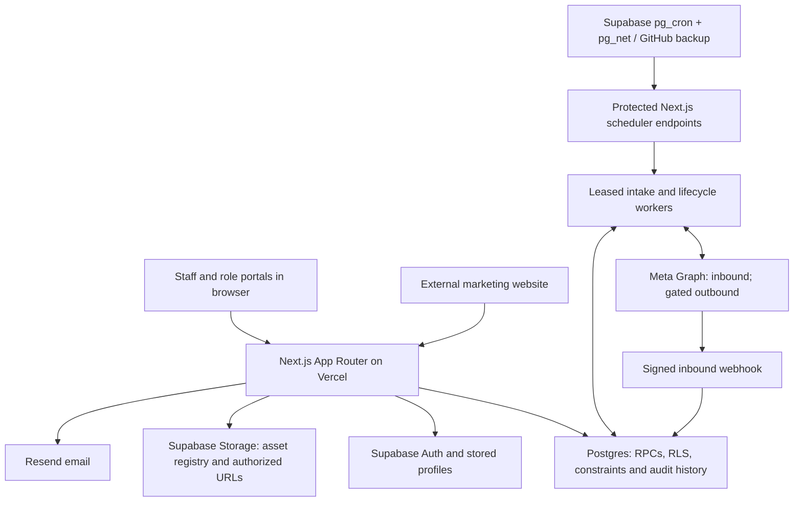

# English Hills platform architecture

## Purpose

English Hills is a production school-management application for inquiry follow-up, admissions, teaching operations and financial records. Staff work in a shared administrative application; teachers, parents and students have restricted portals. The external marketing website can submit inquiries or public registrations through separate interfaces. CRM acquisition and marketing feedback support the school workflow; they do not own enrollment or financial truth.

This is the **master technical entry point**. [CURRENT_STATE](CURRENT_STATE.md) owns implementation/deployment/activation evidence; [FEATURE_INDEX](../architecture/FEATURE_INDEX.md) maps capabilities to code and contracts. Plans are not proof of implementation, and merged code is not proof of live operation.

## State vocabulary

| State | Meaning |
| --- | --- |
| LIVE | Operational use is supported by dated Production evidence; the evidence's scope and date still matter. |
| IMPLEMENTED / DORMANT | Code/database capability exists but delivery or activation is intentionally closed. |
| IMPLEMENTED — NEEDS VERIFICATION | Repository implementation exists; feature-specific Production acceptance is not established. |
| PARTIALLY IMPLEMENTED | Some of the intended capability exists; named work remains. |
| PLANNED | Direction or contract exists, without completed implementation evidence. |
| MISSING ARCHITECTURE | An established need has no durable design yet. |
| HISTORICAL | Preserved reasoning, observations or superseded procedure; not current execution authority. |

Deployment is a separate dimension: record the source revision, migration ledger and observed gates independently. Credential readiness, dormant integration acceptance, successful provider delivery and optimization eligibility are distinct claims.

## System overview

Next.js 15 / React 19 renders the application. TanStack Query caches browser reads; Tailwind/shadcn supplies UI primitives. [Ordinary entity access](../../src/lib/entities.js) uses Supabase under RLS; [CRM hooks](../../src/lib/crm/queries.js) use dedicated guarded RPCs. Cross-entity transactions, role checks, constraints and triggers live in cumulative PostgreSQL migrations. This is one application/database architecture, not separate CRM and school systems.

## Domain map

| Domain | Responsibility and boundary |
| --- | --- |
| Acquisition | Meta/website submissions, immutable mappings, durable queue, attribution and ambiguous-match review. Receipt of an inquiry is not enrollment. |
| CRM | Contacts, learner/program opportunities, commercial status, tasks, activities, Today and placement follow-up. |
| Admissions/enrollment | Public pre-registration, student matching, program/year/level/group selection and explicit enrollment evidence. |
| Academics | Students, teachers, groups, timetable, attendance, assessments, portfolios, certificates and Premium workshops/homework. |
| Finance | Charges, installments/payments, receipt snapshots, balances, audited corrections and payroll. Conversion and collected revenue remain distinct. |
| Reporting | School reports and finance aggregates; director CRM cohort/revenue/marketing analysis, with unavailable spend kept explicit. |
| Integrations | Independent inbound Meta, website intake, dormant lifecycle feedback, unfinished live Insights sync and email delivery. |
| Portals | Teacher operational views and linked parent/student access; not an online classroom platform. |

## Core entities

| Entity | Meaning / ownership |
| --- | --- |
| Contact | CRM adult/contact identity; may represent multiple learners. A shared phone does not establish a single learner. |
| Lead / opportunity | Commercial inquiry for a learner/program context, with its own status, tasks and activity history. It is not the student dossier. |
| Learner / student | School learner record, matched or explicitly created through trusted enrollment/operational flows. Siblings remain separate. |
| Enrollment | Learner's admission into a program and school year, with status, level and optional compatible group. Trusted confirmation drives CRM conversion. |
| Group | Teaching cohort with session/program, level, teacher and schedule relationships. Membership must agree with enrollment. |
| Academic session | Program/session type (for example Yearly or Adults) scopes levels/groups; school year scopes enrollment. A Premium workshop session is a scheduled teaching event, not an online room. |
| Charge / payment / receipt | Agreement, actual collection and immutable payment snapshot respectively. Balance is derived from the financial engine; later payments do not rewrite old receipts. |
| Attribution | Original acquisition source snapshot, distinct from latest touch and current provider names. First touch is immutable. |
| Lifecycle outbox / destination | Durable intent and bounded attempts derived from committed CRM facts; destination/configuration, provider contract and activation evidence independently control delivery. |

Full schemas remain in [migrations](../../supabase/migrations); durable business rules are in [PRODUCT_RULES](PRODUCT_RULES.md).

## Role model

Director has school management plus CRM technical configuration, revenue/reporting and privileged corrections. Admin has broad school operations with narrower CRM technical rights. Receptionist has bounded operational admissions, students, groups, attendance, receipts and safe teacher access, without management analytics, integrations or teacher compensation. Teachers use linked academic relationships; parents/students use linked family/self records. Pending or unknown roles have no operational access.

[SECURITY_RULES](SECURITY_RULES.md#current-roles) defines exact boundaries. Sidebar visibility is not authorization: [middleware](../../src/middleware.js), page guards, independently authenticated API handlers and database RPC/RLS enforcement must agree. Stored profile roles, not editable client metadata, are authoritative.

## Core workflows

**Inquiry → opportunity → placement → enrollment → student/group → conversion.** Acquisition queues a submission, then resolves contact/opportunity or requests review. Placement records real booking/results and follow-up; it is not compulsory invented evidence for every admission. A qualified opportunity can explicitly start enrollment after learner-candidate review. Submitted/Trial initiation is not conversion. Confirmed/Validated linked enrollment is conversion evidence; confirmed enrollment may await a group, while compatible assignment yields Validated. Historical conversion survives later contradiction with a review flag.

**Charge → payment/receipt → balance/revenue.** Authorized commands create an agreement and record actual collection. Zero payment can create a charge but no receipt or payment-driven enrollment. Actual linked payment/void events drive collected CRM revenue; quotations, charges and commercial status do not. Preserve retry identity and append-only financial history.

**Enrollment/group → teaching schedule → attendance and learning evidence.** Academic relationships govern teacher access and student/group consistency. Attendance, assessments and portfolios describe teaching activity; Premium sessions add workshops, membership, attendance and homework. They do not imply video-room, breakout or remote-access architecture. See [WORKFLOWS](WORKFLOWS.md) for operational journeys.

## Opportunities source architecture

The [O3-r2 Batch-1 implementation](../architecture/evidence/outcome-3-batch-1-implementation-2026-10-05.md) extends the existing CRM workspace, drawer, command dialogs, placement and enrollment components. Four additive authenticated read RPCs provide bounded Board/List membership and counts, cursor facets, a fixed first/latest acquisition projection and cursor operational history. Existing semantic commands own every stage transition; drag only proposes a dialog. Conversion still follows trusted enrollment. Reads retain existing authorization helpers and explicit compact projections, without new RLS, write semantics or indexes. See [CURRENT_STATE](CURRENT_STATE.md#outcome-3-batch-1-production-closeout) for Batch-1 merged/deployed/Production-verified evidence including migration 107, and Batch 2’s source/validation status below.

## Tasks and Admissions Calendar source architecture

The authorized [O3-r2 Batch-2 source implementation](../architecture/evidence/outcome-3-batch-2-implementation-2026-10-05.md) extends `/crm/today` with task-centric assignee/owner filters, independent cursor pages and server Casablanca bucket boundaries. `crm_get_work_queue` enriches only bounded task IDs; counts and selected membership share a statement snapshot. `/placement-tests?view=calendar` mounts a separate bounded agenda over placement tests and open center visits, excluding the existing eager list loader. `crm_get_admissions_calendar` returns only fixed event fields, including truthful unspecified legacy times and genuine visit end times. Clicking reuses the shared lead drawer or existing unlinked placement modal with bounded options. No write, RLS, finance/conversion, provider or calendar-table architecture changes. Source validation/review/release remains incomplete as recorded in the linked evidence; Production is still recorded through Batch 1/107.

## Acquisition and integrations

Meta signed webhook and independently enabled bounded reconciliation enqueue the same `crm_ingestion_jobs` identity. Reconciliation discovers IDs; the shared worker retrieves and normalizes them with immutable mappings. Leases, idempotency and guarded finalization fence overlapping workers. The database-owned activation watermark and rolling lookback are not historical backfill or a durable pagination cursor. Exact ownership conflicts stop discovery while independent intake continues. [ADR-002](../architecture/decisions/ADR-002-meta-intake-and-reconciliation.md).

Website `/api/public/crm-inquiry` validates origin, bounded input, rate limits and optional CAPTCHA before durable acceptance. Resolution is asynchronous. `/api/public/inscription` is a distinct public student/enrollment registration flow. Multiple forms/mappings are supported; campaign attribution is separate from source configuration. Director source onboarding UX and safe incremental lifecycle source activation remain gaps identified in the [multi-source assessment](../architecture/evidence/crm-multi-source-readiness-2026-10-01.md).

Lifecycle feedback consumes committed CRM facts asynchronously through the existing outbox. The R4 model supports Intake, Not qualified, Lost, Qualified and Converted with genuine occurrence semantics, strict original timestamps, prospective source/cohort and producer ownership, privacy/stops, frozen payloads, bounded leases and no uncertain replay. Live matching is original Meta lead ID only plus approved nonpersonal CRM constants; child, financial and arbitrary form data are excluded. Independent database, destination, server and scheduler gates remain mandatory. [ADR-004](../architecture/decisions/ADR-004-meta-lifecycle-feedback.md) owns decisions; [S1](../architecture/plans/crm-meta-lifecycle-credential-simplification.md) and its [sole credential runbook](../architecture/plans/crm-h3-s1-gate-b-credential-runbook.md) own credential procedure. Current activation facts belong in CURRENT_STATE.

Meta Insights has reporting/snapshot architecture and fixture processing, but no completed live sync. Website acquisition CAPI Lead and website lifecycle matching are planned separate adapter work, not capabilities of the current original-Meta-lead-ID contract. [Insights contract](../crm-meta-insights.md).

[Email](../../src/lib/email.js) uses server-side Resend via authenticated routes and receipt workflows; local development disables external email. WhatsApp links/activity recording are not proof of an automated WhatsApp provider integration. Provider readiness must be established separately from UI availability.

## Infrastructure and security

[Session clients](../../src/lib/supabase.js) and the [server-only privileged client](../../src/lib/supabase-admin.js) have different authority. Secrets resolve transiently on the server, never from database payloads or browser bundles. SECURITY DEFINER RPCs require explicit actor/role validation, fixed search paths and restricted grants. Storage access uses the asset registry and authorized signing/finalization rather than public dossier URLs.

Supabase pg_cron/pg_net is the primary intake trigger, with a GitHub Actions backup to the same bounded endpoint. Lifecycle uses an independent scheduler and independent gates. Main deploys through Vercel; source merge, database migration application, configuration and Production acceptance are separate evidence states. Deployed migrations are immutable. Local testing uses synthetic data and local Supabase. [AGENTS](../../AGENTS.md) alone owns execution, CI, review and release policy, including the adopted docs/tooling/full lanes and outcome batching.

## Capability and dependency map

The [current capability register](CURRENT_STATE.md#capability-register) distinguishes live inbound intake, implemented school operations, dormant outbound infrastructure and planned work. The [feature index](../architecture/FEATURE_INDEX.md) is the route/module/migration map. The next meaningful outcomes are separately authorized dormant lifecycle integration acceptance (H3-06/07/08), prospective lifecycle activation (H4/Gate C), receptionist Today/detail/walk-in design and implementation, and completing live Insights. Credentials alone do not complete any of those outcomes.

## Architecture gaps

- **Online learning — MISSING ARCHITECTURE:** no durable room/video-provider/access/breakout/online-session design. Existing academic and portal records do not fill this gap.
- **Receptionist UX — PARTIALLY IMPLEMENTED / PLANNED:** Batch 1 permissions are complete; [ADR-003](../architecture/decisions/ADR-003-receptionist-operations-role.md) governs the remaining Today/detail/walk-in direction. The owner will supply the CRM workflow/design before Outcome 3.
- **Meta Insights — PARTIALLY IMPLEMENTED:** reporting exists; live provider sync remains unfinished.
- **Multi-source acquisition follow-through:** Director onboarding, incremental lifecycle activation and website matching need the bounded follow-up work identified above.

This document does not design SaaS/multi-tenancy or management agents.

## Navigation and document ownership

| Document | Authority |
| --- | --- |
| [AGENTS](../../AGENTS.md) | Engineering execution, CI, review and release policy. |
| [ARCHITECTURE](ARCHITECTURE.md) | Current platform structure; master technical entry point. |
| [CURRENT_STATE](CURRENT_STATE.md) | Current implementation, deployment and activation evidence with limits. |
| [PRODUCT_RULES](PRODUCT_RULES.md) | Durable business invariants. |
| [SECURITY_RULES](SECURITY_RULES.md) | Durable authorization, privacy and secret boundaries. |
| [WORKFLOWS](WORKFLOWS.md) | Current operational/user journeys. |
| [ADRs](../architecture/decisions/README.md) | Durable decisions, rationale and explicitly scoped amendments. |
| [Active contracts/runbooks](../architecture/plans/README.md) | Current implementation/operator contracts; approval never inferred from their presence. |
| [FEATURE_INDEX](../architecture/FEATURE_INDEX.md) | Navigation and state mapping, not another specification. |
| [Historical index](../architecture/history/README.md), [completed plans](../architecture/plans/completed), [evidence](../architecture/evidence) | Preserved reasoning, release/implementation evidence and superseded procedures; dated evidence supports current claims but is not an instruction to replay operations. |
