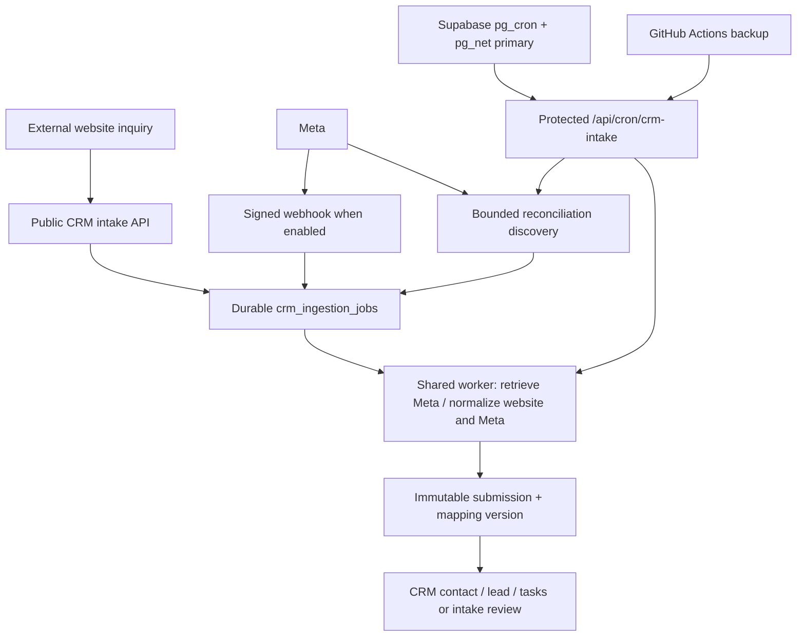
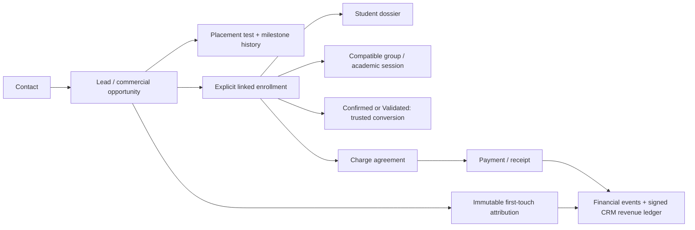

# Current architecture

> Finally owner-approved 2026-10-01 (PR #46, architecture head `c404815`): [R4 advisory D2 amendment](../architecture/plans/crm-meta-funnel-r4-d2-advisory.md) changes custom proof from mandatory to recommended while preserving platform/legal/privacy, source/identity, prospective cutoff, producer ownership, five-event and no-uncertain-replay safeguards. Any mandatory-D2 text below describes the deployed baseline until reviewed forward implementation; actual withdrawals/stops remain enforceable even without a grant. The approved opportunity/contact/pending stop scopes and exact lock/retention contract are part of this architecture. Migration 103 and compatible runtime/UI are implemented on `codex/r4-advisory-d2`, pending exact-head CI and independent review; see the [implementation record](../architecture/evidence/crm-r4-advisory-implementation-2026-10-01.md). This branch is not merged or deployed; deployment is NOT authorized; H3/H4 are NOT approved and remain blocked. [Final approval record](../architecture/plans/crm-meta-funnel-r4-d2-advisory.md#final-owner-architecture-approval-2026-10-01).

Read [CURRENT_STATE](CURRENT_STATE.md) for the main baseline versus documented deployment. Decisions and rationale are indexed in [ADRs](../architecture/decisions/README.md).

## Application and database

Next.js 15 App Router serves the admin workspace, role portals, public enrollment and API handlers. [Admin layout](../../src/app/(admin)/layout.jsx) wraps pages in ProtectedRoute; [middleware](../../src/middleware.js) refreshes sessions and gates page routes. Handlers authenticate independently. Stored `profiles.role` joins Auth through `profiles.id = auth.users.id`; authorization continues into RPCs/RLS.

[entities.js](../../src/lib/entities.js) provides ordinary entity CRUD and [queries.js](../../src/lib/queries.js) TanStack Query caching. CRM uses [dedicated RPC hooks](../../src/lib/crm/queries.js) and guarded SQL commands/read models. Browser/session server clients live in [supabase.js](../../src/lib/supabase.js); privileged [supabase-admin.js](../../src/lib/supabase-admin.js) is server-only. PostgreSQL transactions, constraints, triggers and cumulative migrations own cross-entity integrity. Storage uses an asset registry and authorized signing/finalization endpoints (045–046), not public dossier URLs.

## Acquisition and scheduling

The primary trigger exists in migration 095; Production activation was independently verified in owner-supplied evidence on 2026-09-29 (see CURRENT_STATE). Both triggers invoke the same bounded endpoint, use the dedicated scheduler bearer, and rely on database leases plus unique event identities. Reconciliation discovers IDs only; the shared worker retrieves and normalizes them. Independent webhook/reconciliation switches allow polling while webhook access is unavailable. [ADR-002](../architecture/decisions/ADR-002-meta-intake-and-reconciliation.md) and [scheduler runbook](../crm-intake-scheduler.md) contain limits and activation details.

Website acceptance means durable receipt, not immediate lead resolution. Exact-origin checks, validation, rate limiting and optional CAPTCHA precede queueing. Immutable mapping versions normalize core fields and flexible answers; uncertain matching becomes review. [Website contract](../crm-website-inquiries.md).

## CRM and school operations

Placement booking/results drive tasks and activities, not automatic enrollment/payment. Enrollment commands review existing learner candidates; enrollment/student/group triggers preserve membership consistency (070–074, 083–084). Groups, levels, timetables, attendance and Premium sessions share academic relationships; [071](../../supabase/migrations/071_teacher_academic_relationships.sql) governs teacher academic access.

Payments use the existing charge/receipt engine and explicit CRM enrollment identity. Revenue attribution follows linked receipts and immutable first touch (085); director analytics combines operational cohorts and available spend snapshots (089–090). Insights remains fixture-only. Deployed migrations 098–100 extend lifecycle feedback with explicit eligibility evidence, prospective activation epochs, lead-ID-only live payload enforcement, retention cleanup, director-only diagnostics and an independent `crm-lifecycle-primary` scheduler. Production verification on 2026-09-30 found that scheduler inactive, with zero provider contracts, policies/evidence, open activation epochs, live deliveries or enabled lifecycle destinations. No provider credentials/configuration or form changes were made. The live path therefore remains dormant and fail closed pending H3/H4; deployment is not evidence of live Meta activation.

Teacher operational identity is projected through [teacher-directory.js](../../src/lib/teacher-directory.js). Full teacher rows contain HR/compensation and are isolated from non-HR consumers (043); payroll writes use an authenticated admin/director API and database guard (065). Batch 1 added the fixed receptionist operational teacher projection in 096, with Production activation reported by the owner. PR #32 and 097 completed the shared Students UI and enrollment-aware group filter; Batch 1 Production verification was owner-confirmed on 2026-09-29. [Security rules](SECURITY_RULES.md).
